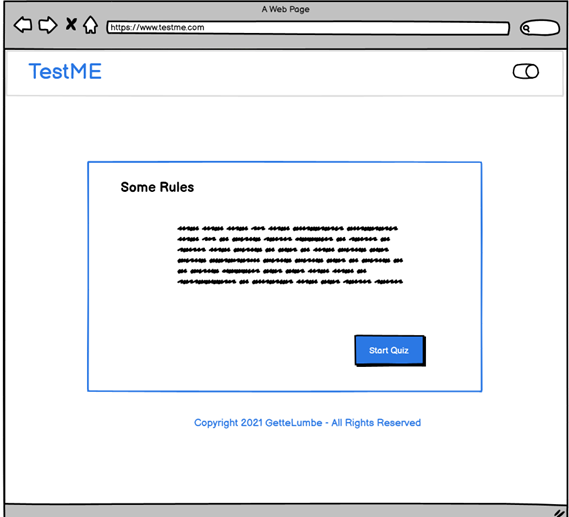
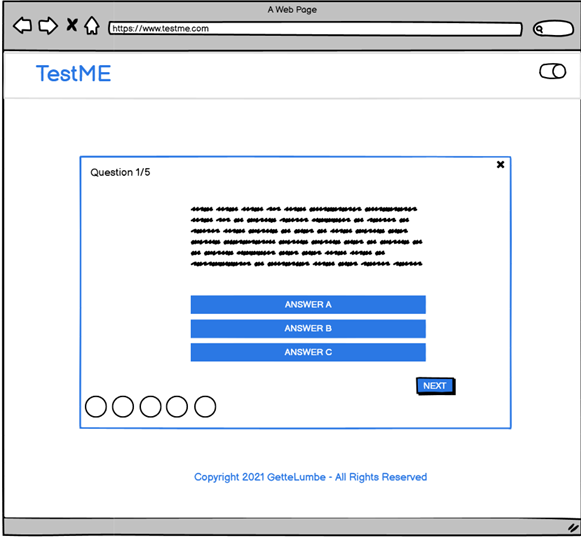
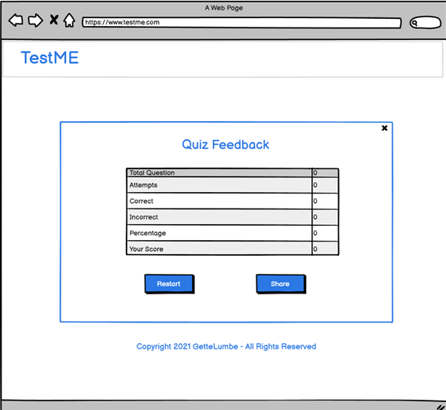
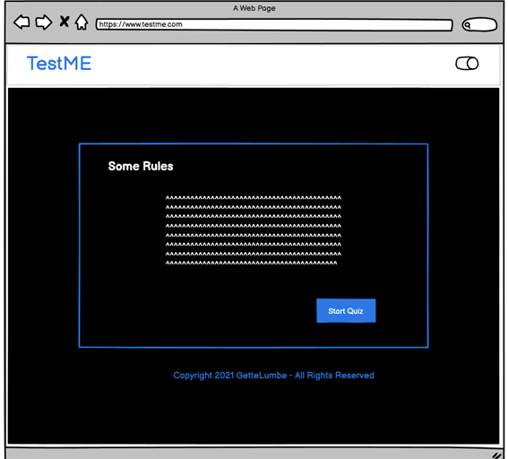
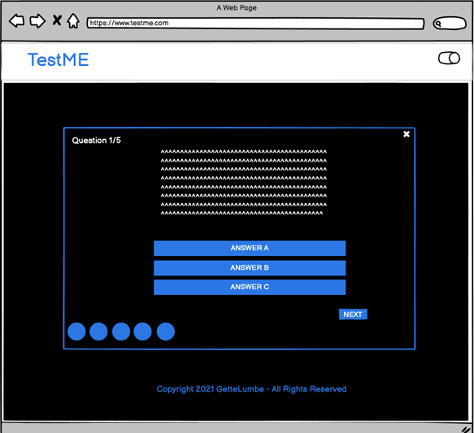
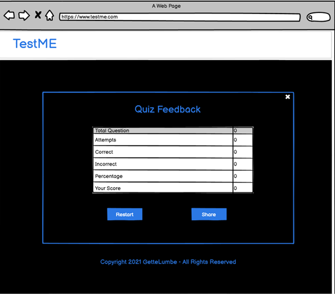
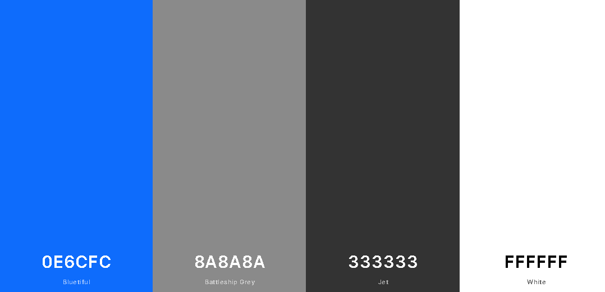

# TESTME

Responsiveness images

[View the live project here]()

# Table of Content

1. [Introduction](#introduction "Goto introduction")

2. [UX](#ux "Goto ux")

    - [Ideal User Demographic](#ideal-user-demographic "Goto ideal user demographic")
    - [User Stories](#user-stories "Goto user stories")
    - [Development Planes](#development-planes "Goto development planes")
    - [Design](#design "Goto design")

3. [Features](#features "Goto features")

    - [Existing and Design Features](#existing-and-design-features "Goto existing & design features")
    - [Features to Implement in the future](#features-to-implement-in-the-future "Goto features to implement in the future")
    
4. [Testing](#testing "Goto testing")

    - [Testing.md](#)

5. [Issues and bugs](#issues-and-bugs "Goto issues and bugs")

6. [Technologies used](#technologies-used "Goto technologies used")
 
    - [Main Languages Used](#main-languages-used "Goto main languages used")
    - [Libraries, Frameworks and Programs Used](#libraries-frameworks-and-programs-used "Goto libraries, frameworks and programs used")
    
7. [Deployment](#deployment "Goto deployment")

    - [Deployment on Github Pages](#deployment-on-github-pages "Goto deployment on github pages")
    - [Forking the Repository](#forking-the-repository "Goto forking the repository")
    - [Creating a Clone](#creating-a-clone "Goto creating a clone")

8. [Credits](#credits "Goto credits")

    - [Content](#content "Goto content")
    - [Media](#media "Goto media")
    - [code](#code "code")

9. [Acknowledgements](#acknowledgements "Goto acknowledgements")

---

# INTRODUCTION

TestME is a fun, interactive website that engages the user in a general knowledge quiz with questions on geography, math, history, cooking, eye and brain test and more. It is a multiple choice game, with random questions and answers each time the user starts the quiz.  The user can see the quiz instructions before starting and after completing the quiz they can see their score and have the option to replay the quiz and share their score to friends and TestME community on Facebook.

This is the second of five milestone projects that the developer is required to complete as part of their full web development course at the Code Institute. The main requirements were to create a responsive and interactive website using mainly *HTML5*, *CSS3* and *JavaScript*.

# UX

## Ideal User Demographic

### The ideal user of this quiz

* Quiz lovers
* General culture lovers
* People who like general knowledge quiz
* People who like to exercise their brain
* People who like to test their general knowledge
* People who want to know new things
* People who want a quick, simple and elegant quiz application.

## User Stories

### As a new user:

* I would like to see where to start playing
* I would like to navigate easily to the website
* I would like to set the dark mode when I play at night.
* I would like to know the instructions before starting the quiz
* I would like to know how many questions I have left
* I would like to see how many questions that I got wrong
* I would like to leave the quiz whenever I want
* I would like to have a very clear feedback when I finish the quiz
* I would like to be able to share my score with my friends and TestME community on Facebook

### As an returning user:

* I would like to navigate easily to the online quiz
* I would like to see new questions

### As a website creator:

* I want to make the quiz fun and interactive
* I want to ensure that there are enough questions
* I want to make sure that the user enjoys the quiz
* I want to provide an option for new and returning users to share their score on Facebook.

## Development Planes

To create an interactive and fun quiz that displays all data clearly with consistent styling across all pages, TestME creator worked with its developer to discern the required functionality of the quiz and how it would respond to the stories and expectations of users, as described above. 

### Strategy

The quiz will be focus on the following three categories of target audiences:

1. Demographic
    * All ages
    * People in any field
    * Learners

2. Position
    * New users
    * Returning users

3. Centre of interest
    * Quiz lovers
    * People who enjoy general knowledge
    * People who like to test their knowledge
    * People who want a quick, simple and elegant quiz application.

The online quiz needs to facilitate the user to:

1. Access informations below:
    * The instructions before starting to play  
    * The feedback after finishing to play
    * A Share score option on Facebook

The online quiz needs to facilitate the TestMe creator to:

1. Maintain an online presence
2. Get more players
3. Get multiple users to react on the official TestME facebook account by sharing their score and discuss.

### Scope

There are two categories of requirements that were defined in order to clearly identify what needed to be done to align the functionality with the previously defined strategy.

1. Content Requirements

    * The user will be looking for:
        - Where to start playing
        - The instructions
        - The feedback and score
        - Where to share score
        - Where to set the dark mode

2. Functionality Requirements

    * The user will be able to:
        - Navigate easily through the site to find information he wants
        - Find link to external site in order to stay connected with the TestME' community and share score

### Structure

The structure of the application has been designed to provide a simple and seamless user experience. A simple design will be implemented on all pages. The flow of the pages will be natural and will allow the user to feel comfortable after viewing a single page.

1. Header

    * The logo will serve as a link to the homepage
    * The label will serve to set the dark mode

2. The info box

    * The info box contains the instructions and the start quiz button at the bottom
    * The start quiz button leads user directly to the quiz

3. Quiz box

    * A counter to show what question the user is on
    * Questions
    * Three options which only one is correct
    * Next button at the bottom which will pass to another question
    * Correct and incorrect section, which show how many questions that the user got wrong and correct. 

4. Feedback box

    * A table of result that will tell the user his attempt, percentage, score, how many questions he got wrong and correct
    * Two butons at the bottom:
        - Play again: will lead again the user directly to the quiz
        - Share: will lead the user to Facebook where he can share his score with friends

5. Exit icon

    * On each box except the info box, there is an exit icon that can take the user back to the principal page

6. Footer

    * A Copyright

### Skeleton

Wireframes moch-up were created in a balsamiq workspace with providing a responsiviness and positive user experience in mind.

* Light Mode of home, quiz and feedback boxes:

* Dark Mode of home, quiz and feedback boxes:

## Design

1. Typography

    * At the beginning of this project, the developer had opted for a combination of fonts [Balsamiq](https://fonts.google.com/specimen/Balsamiq+Sans?query=bals) and [Montserrat](https://fonts.google.com/specimen/Montserrat?query=monts) but after deploying the site and testing on mobile and tablet, he decided to change fonts and opted this time for a combination of [Mate SC](https://fonts.google.com/specimen/Mate+SC?query=mate) and [Montserrat](https://fonts.google.com/specimen/Montserrat?query=monts) fonts which are used throughout the quiz, with Sans Sérif as a back-up font in case of import failure.

2. Colour Scheme

    * At the start of this project, the developer had opted for a rather complex colour combination, but after deploying the site and testing it on mobile and tablet, and seeing that he had to put it in dark mode, he decided to change the colours to something simple. 

    * The colours used throughout the site for its main styling are shown below, this mix of colours comes from [coolors](https://coolors.co/) and they were chosen for a better design to maintain a simplified pleasure for the user, he can change the mode when it suits him

    * These colours are used in a specific and complementary way, maintain a good level of contrast in both dark and light modes.
    * There is a layer of red for when the user will choose a wrong answer and and the layer of green when he will choose the correct answer.

3. Images and Icons

    * The images for some questions was sourced from [Pinterest](https://www.pinterest.com/pin/502855114653749177/).
    * Some icons have been used in the site. [Font Awesome](https://fontawesome.com/) was the main source of icons.

# FEATURES

## Existing and Design features

### HOME PAGE

1. Header

    * The header contains a conventionally placed logo at the top left of the page (redirects the user to the home page in one click).
    * At the top right, there is a label for switching the mode of the site.

2. Landing Page 

    * The landing page includes a colour white or black as a background with a info box overlaid.

3. Info Box

    * This section allows the user to view the quiz instructions before starting to play.
    * It also allows the user to start the quiz.
    * It is represented by a box of text (instructions) and the start quiz button at the bottom.

    

4. Quiz Box

    * This section allows the user to view :
        - The quiz and start playing.
        - A counter that show what question user is on
        - Questions
        - Three options of which only one is correct
        - Indicator answers, which show how many questions that the user got wrong and correct.

    * It also allows the user to either move on to another question or exit the quiz by the exit icon at the top right of the box.
    * It is represented by a box of text (quiz)
    * In fact, this section is hidden and to see it, just click on the start quiz button on the bottom in the info box.

 

5. Feedback section

    * In this section, the user will have the feedback on his quiz. He will be able to see his attempt, his score, his percentage and how many questions he got wrong and correct, and make the choice to eitheir restart the quiz, share his score or exit the feedback by the exit icon at the top right of the box.. 
    * It is represented by a box of text (feedback).
    * In fact, this section is hidden and to see it, just finish the quiz.

8. Footer

    * This section shows the copyright and the name of the creator.

## Features to implement in the future

1. The progressive Web Application (PWA)

    * Feature: implement the PWA to allow users to install the application on their own devices.
    * Reason for not featuring in this release: the web developer needs more knowledge on this subject.

2. Competition within users on Facebook and Instagram

    * Feature: implement an option for players to compete with each other, and to invite their friends to participate in TestME quiz.
    * Reason for not featuring in this release: the web developer needs more knowledge on this subject.

3. Register

    * Feature: allow users to register and create a username, to save their score.

# Testing

Testing information can be found in a separate [testing file](https://github.com/Georgette-Lumbe/test_me/blob/master/TESTING.md).

# Issues and Bugs

The developper met some issues during the development of the website, below are the issues, bugs and solutions that the devloper has encountered:

# Technologies used

## Main Languages Used

1. [HTML5](https://fr.wikipedia.org/wiki/HTML5)
2. [CSS3](https://en.wikipedia.org/wiki/CSS)
3. [JavaScript](https://en.wikipedia.org/wiki/JavaScript)

## Libraries, Frameworks and Programs Used

1. [Balsamiq](https://balsamiq.com/wireframes/?gclid=Cj0KCQjwna2FBhDPARIsACAEc_XbjAS__pJWBfq4NdpfXxxOVWlh4qsEro7gWthlg3GopXgZgB5PkeQaAiu-EALw_wcB) was used to create the wireframe during the design and reflective phase of the project.
2. [Google fonts](https://fonts.google.com/) was used to import the fonts “Mate SC” and “Montserrat” into the style.css file. These fonts were used all over the project.
3. [Fonts awesome](https://fontawesome.com/) was used on all pages throughout the website to import icons for the user experience purposes for example social media links, question mark, crown, refresh and exit buttons .
4. [Git](https://git-scm.com/) was used for version control by using the GitPod terminal to commit to Git and push to GitHub.
5. [GitHub](https://github.com/) was used to store the project after pushing.
6. [Am I Responsive?](http://ami.responsivedesign.is/#) was used to view the responsive design throughout the process and to generate image mock-ups for use.
7. [Coolors](https://coolors.co/) was used for colour inspiration and pallet
8. [Favicon](https://favicon.io/favicon-converter/) was used to convert an image to a favicon for the Love Vegetables.
9. 

# Deployment

This project was committed to git and push to Github using the workspace terminal.

## Deploying on GitHub pages

To deploy this website to GitHub repository, the developer followed these steps:

1. Log into [GitHub](https://github.com/)
2. Locate the GitHub Repository
3. Select settings from the menu at the top of the repository
4. Scroll down the settings page to the *GitHub Pages* section
5. Click on *check it out here!*
6. Under *source* click the drop-menu *None* and select *Master Branch*
7. Above selection, the page will automatically refresh and show that the website was deployed successfully
8. Refresh  again GitHub, the deployed link will be on the *GitHub Pages*

## Forking the Repository

To make a copy of the original repository on our GitHub account, we need to fork the GitHub Repository. To view or/and make changes withount affecting the original repository, we need to foloow these steps:

1. Log into [GitHub](https://github.com/)
2. Locate the GitHub Repository
3. On the right side of the page, at the top of the repository, select *Fork*
4. A copy of the original repository will be in your GitHub account

## Creating a clone

More steps need to be follow for running project locally:

1. Install the GitPod Browser extension for chrome
2. After installation, restart the browser
3. Log into GitHub Repository
4. Click the green *GitPod* button. This will set of a new GitPod workspace to be created from the code in GitHub where you can work locally.

These are steps to run this project within a local IDE:

1. Log into [GitHub](https://github.com/)
2. Local the GitHub Repository
3. Under the repository name, click *clone or download* 
4. In the Clone with https section, copy the URL for the repository
5. In your local IDE open the terminal
6. Change the current working directory to the location where you want the cloned directory to be made
7. Type *git clone*, and then paste the URL you copied in the step 4
8. Press Enter. Your local clone will be created.

# Credits

## Content 

* The developer has consulted some websites to take diffents questions and answers for TestME quiz :
    - [70+ Multiple Choice Trivia](https://triviaquestions4u.com/multiple-choice-trivia-questions-and-answer/)
    - [Fun Trivia ](https://holidappy.com/holidays/Fun-Free-Quiz-for-St-Patricks-Day)
    - [Ultimate Vegetable Quiz Questions](https://www.ultimatequizquestions.com/vegetable-quiz-questions/)

## Media
* The developer used four images for some Math questions and they was taken from [Pinterest](https://www.pinterest.com/pin/502855114653749177/).

## Code 

* The developer has consulted some websites and tutorials in order to better understand and use the code for this site. Beloow are the sites and tutorials used:

    * [Stack Overflow](https://stackoverflow.com/)
    * [Youtube](https://www.youtube.com/)

        Tutorials:
        - [Coding Nepal](https://www.youtube.com/channel/UCk7xIEmd3MeyhIu2StLX5yA)
        - [D Greenwood](https://www.youtube.com/watch?v=ykszkgydoG4)
        - [Web Dev Simplified](https://www.youtube.com/watch?v=riDzcEQbX6k&t=1415s)
        - [The WebShala](https://www.youtube.com/watch?v=J8QbjXdVl9c&t=206s)
        - [WebCode](https://www.youtube.com/watch?v=1BC_BN5Kzbo)

    # Acknowledgements

    * I would like to thank my mentor, Seun and my tutor Kasia for their helpfulness, constructive advice, feedback and guidance.
    I would like to thank my family, my friend Esther Booto, and my boyfriend Jimmy for all the support during this project.
    * I would like to thank my colleagues of Code Institute and Slack Community for sharing their posts and experience.
